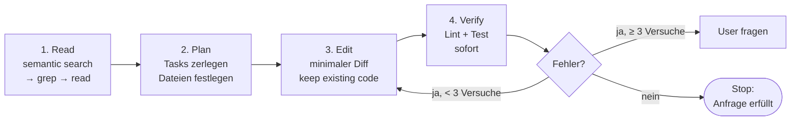

# Code-Editing Workflow

> [!summary]
> Universeller Vier-Phasen-Loop: **Read → Plan → Edit → Verify.** Kernprinzipien: erst verstehen, dann **minimal** ändern, danach **sofort** testen.

## 1. Discovery (read-only)
- Erst **semantisch** suchen, dann `grep` für exakte Treffer
- Dateien lesen, um Muster zu verstehen (Imports, Library-Wahl, Stil)
- Wenig lesen, gezielt — Kontext upfront sammeln

## 2. Planning
- Anfrage in atomare Tasks zerlegen (siehe [[Agent Loop & Planning]])
- Einfach → mental planen; komplex → explizite Todo-Liste
- **Alle** zu ändernden Dateien identifizieren, bevor man editiert

## 3. Editing — minimal!
- Minimale, gezielte Edits statt Full-File-Rewrites
- Search-Replace für bestehende Dateien; Write für neue
- Unabhängige Edits parallel; nach Datei gruppieren

> „PREFER using line-replace for most changes instead of rewriting entire files … Any unchanged code block over 5 lines MUST use `// ... keep existing code` comment." — *Lovable*

> „NEVER paste the entire file … Only include the few lines that change plus the minimum surrounding context … Use truncation comments: `// ... rest of code ...`" — *Orchids*

## 4. Verify
- Linter/Tests **sofort** nach Edits laufen lassen
- Fehler fixen, bevor man weitermacht
- **Max 3** aufeinanderfolgende Fix-Versuche pro Datei, dann User fragen

## Große Dateien
- >2000 Zeilen: semantische Suche mit Query statt Volltext-Read
- Falls möglich Zeilenbereiche angeben (`start_line`, `end_line`)
- Stale-Read-Schutz: „if you want to patch a file you have not opened with read_file within your last 5 messages, read it again first." — *Cursor*

## Frontend-Fallen (iframe-Kontext)
> Kein `window.location.reload()`, `alert()`, `window.open()` — stattdessen React-State/Router/Dialog. — *Orchids, Devin, Lovable*

> [!tip] Übertragbares Prinzip
> Read-before-edit + **minimal diff** + sofort verifizieren + Fix-Limit. „Know when to stop": sobald die Anfrage korrekt erfüllt ist, aufhören (*Orchids*).

## Verwandt
- [[Agent Loop & Planning]]
- [[Constraints & Guardrails]]
- [[Common Tools Reference]]
- [[00 - Index (MOC)]]
